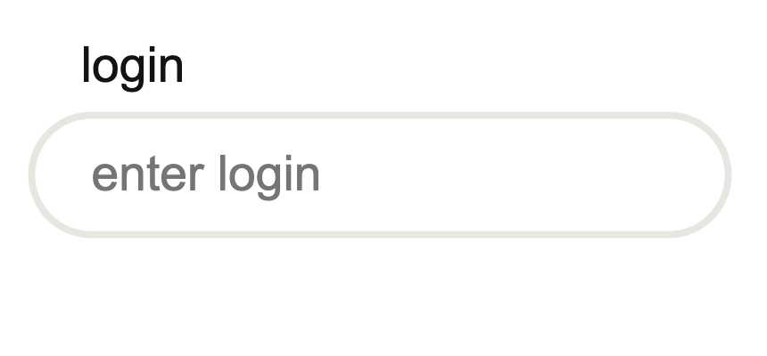
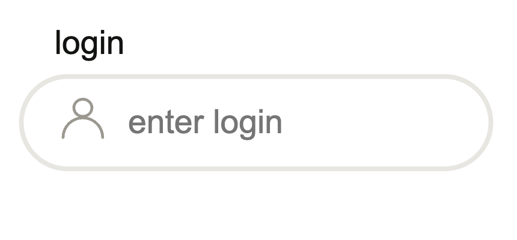
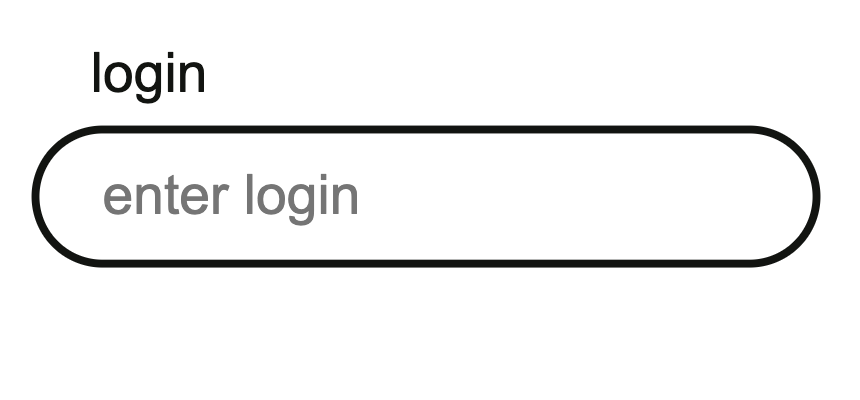
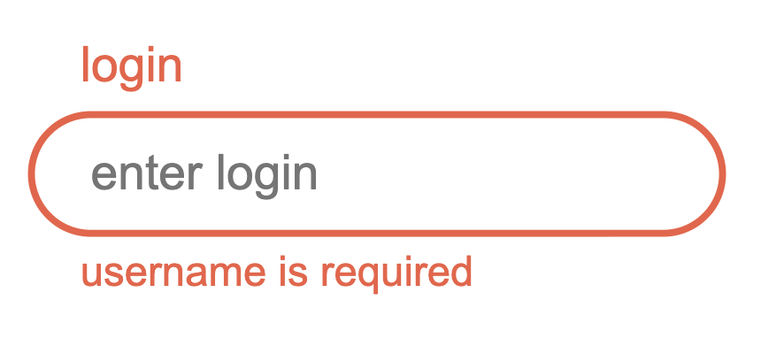
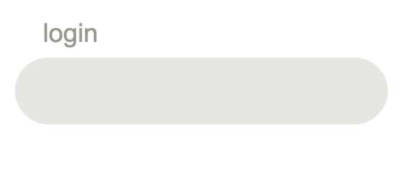
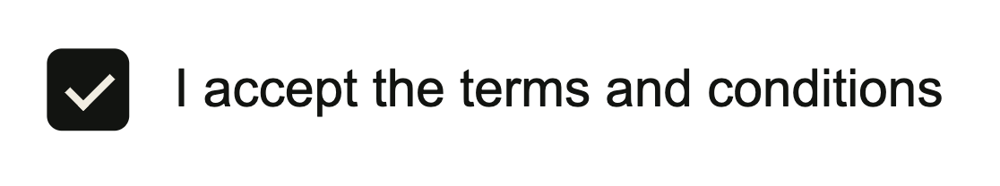
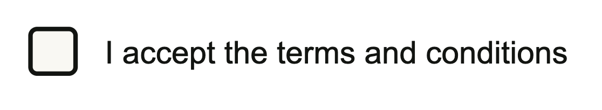

# TNDM UI Kit

A library of reusable, high-performance UI components for the TNDM project. Built with **Angular Signals** and **OnPush** strategy.

---

## Table of Contents

- [Form Components](#form-components)
  - [General Principles](#general-principles)
  - [TndmInputComponent](#tndminputcomponent)
  - [TndmCheckboxComponent](#tndmcheckboxcomponent)
- [Action Components](#action-components)
  - [TndmButtonComponent](#tndmbuttoncomponent)
- [Shared Types](#shared-types)

---

## Form Components

### General Principles

#### Reactive Forms (CVA)

All form components implement `ControlValueAccessor`. This allows seamless integration with Angular Reactive Forms:

```html
<tndm-input-component formControlName="userName" />
```

### TndmInputComponent

A versatile text field supporting various HTML5 input types and validation states.

#### Validation Priority

Error messages are resolved in the following order:

1. **Custom Message** — from `errorMessages` input
2. **Default Message** — fallback from `DEFAULT_ERROR_MESSAGES` constant

#### Visual States

| Default                                    | With Icon                                     | Focus/Hover                                    | Error State                                   | Disabled                                    |
| ------------------------------------------ | --------------------------------------------- | ---------------------------------------------- | --------------------------------------------- | ------------------------------------------- |
|  |  |  |  |  |

#### API (Inputs)

| Property      | Type                   | Required | Default | Description                                   |
| ------------- | ---------------------- | -------- | ------- | --------------------------------------------- |
| id            | string                 | ✅       | —       | Unique identifier for label/input binding     |
| name          | string                 | ✅       | —       | Field name used for generating error messages |
| label         | string                 | ❌       | null    | Text label displayed above the input          |
| type          | InputType              | ❌       | text    | HTML input type (email, password, etc.)       |
| placeholder   | string                 | ❌       | null    | Ghost text displayed inside the field         |
| icon          | IconType               | ❌       | null    | Icon name from the internal library           |
| errorMessages | Record<string, string> | ❌       | {}      | Custom error message overrides                |

#### Usage

```html
<tndm-input-component
  formControlName="email"
  id="user-email"
  name="email"
  type="email"
  icon="email"
  [errorMessages]="{ required: 'email is mandatory' }">
</tndm-input-component>
```

### TndmCheckboxComponent

A custom-styled checkbox built for boolean state management and seamless Reactive Forms integration.

#### Visual States

| Default                                          | Checked                                          | Hover/Active                                 | Disabled                                           |
| :----------------------------------------------- | :----------------------------------------------- | :------------------------------------------- | :------------------------------------------------- |
|  |  |  |  |

#### API (Inputs)

| Property | Type     | Required | Default | Description                                      |
| :------- | :------- | :------: | :-----: | :----------------------------------------------- |
| `id`     | `string` |    ✅    |    —    | Unique identifier for label and checkbox binding |
| `name`   | `string` |    ✅    |    —    | Field name used for form identification          |
| `label`  | `string` |    ❌    | `null`  | Text label displayed next to the checkbox        |

#### Usage

```html
<tndm-checkbox-component
  formControlName="rememberMe"
  id="remember-me"
  name="remember"
  label="Remember me on this device">
</tndm-checkbox-component>
```

---

## Action Components

### TndmButtonComponent

**Status:** Done
Standardized button system supporting multiple variants (primary, secondary, icon).

---

## Shared Types

- **InputType:** `email | password | search | tel | text | url`
- **IconType:** `keyof typeof ICONS` (specific keys from the internal icon library)
